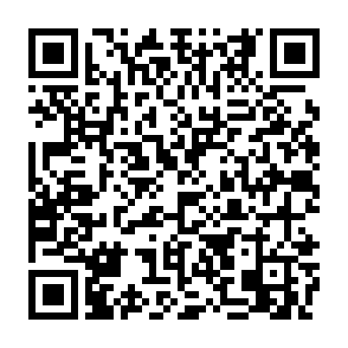

# YouTube Downloader

App para Windows que baixa vídeos e áudios do YouTube e de centenas de outros sites, com o visual do Cinema Production OS.

<p align="center">
  <a href="https://github.com/Wendel4444/YoutubeVideoDownloader/releases/latest"></a>
</p>

- Vídeo em **MP4** (H.264, toca em qualquer aparelho), **MKV** ou **WebM**, até 4K
- Áudio em **MP3**, **M4A**, **Opus**, **FLAC** ou **WAV**, com capa e informações
- Playlists e canais inteiros, fila com progresso, cancelar e tentar de novo
- Mensagens de erro em português que dizem o que fazer
- Usa [yt-dlp](https://github.com/yt-dlp/yt-dlp) e [FFmpeg](https://ffmpeg.org), baixados e atualizados pelo próprio app

## Como usar

1. Baixe o **`YoutubeDownloader-…-win-x64.exe`** na [página de releases](https://github.com/Wendel4444/YoutubeVideoDownloader/releases/latest) e abra. Não precisa instalar nada, nem o .NET.
   Se o Windows mostrar "O Windows protegeu o computador", clique em **Mais informações > Executar assim mesmo** (o executável ainda não é assinado).
2. Na primeira vez, clique em **Baixar e preparar** para o app buscar as ferramentas.
3. Copie o link do vídeo e aperte **Ctrl+V** na janela, escolha o formato e clique em **Baixar**.

Os arquivos vão para `Downloads\YouTube Downloader` (dá para mudar em Configurações).

Baixe apenas conteúdo que você tem direito de baixar.

## Compilar

```powershell
dotnet build
dotnet test
dotnet publish src/YoutubeDownloader.App -c Release -r win-x64 --self-contained false -p:PublishSingleFile=true -o artifacts/win-x64
```

## Apoie o projeto

O YouTube Downloader é gratuito. Se ele te ajuda, você pode apoiar o desenvolvimento com um Pix de qualquer valor:

<p align="center">
  
</p>

**Chave Pix (e-mail):** `delsanvfx@gmail.com`

<details>
<summary>Pix copia e cola</summary>

```
00020126410014br.gov.bcb.pix0119delsanvfx@gmail.com5204000053039865802BR5918YOUTUBE DOWNLOADER6009SAO PAULO62070503***6304FC64
```

</details>

Obrigado!

## Licença

[MIT](LICENSE): use, estude, modifique e distribua à vontade, mantendo o aviso de copyright.
